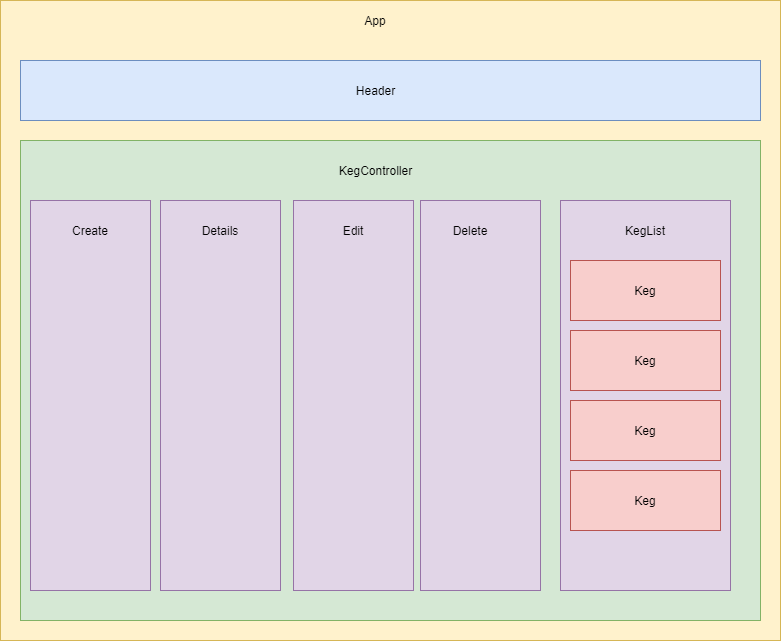

# Tap Room

## About / Synopsis

* This Project tracks kegs, maintaining a count of how many pints left, price, brand, alcohol percent and name
* This project was created following Epicodus' React Fundamentals Independent Project requirments.
* Project status: working
* Created by: Joseph Nilles 11/21/20

## Table of contents

> * [Tap Room](#tap-room)
>   * [About / Synopsis](#about--synopsis)
>   * [Table of contents](#table-of-contents)
>   * [Setup](#setup)
>   * [Usage](#usage)
>     * [Screenshots](#screenshots)
>     * [Features](#features)
>   * [Code](#code)
>     * [Bugs](#bugs)
>     * [To Do](#to-do)
>   * [Resources (Documentation and other links)](#resources-documentation-and-other-links)
>   * [Contact](#contact)
>   * [License](#license)

## Setup

* Clone the project from the repository at https://github.com/jbnilles/tap-room
* Navigate inside the project folder called tap-room
* Open at that location
* In the terminal run the command `npm install`
* Then run the command `npm start` in the terminal
* Open a web browser and go to http://localhost:3000/ 

## Usage
* While using this app you can create kegs and give each one a name, brand, price and percent alcohol. Each keg will automatically be given a quantity of 124 pints. Once a keg is created you may then view the details of each keb buy clicking on it in the list. This will bring up the keg details page. From there you will have the option to edit, delete or buy a pint. The edit gives the same options as create but it includes the quantity, delete removes the keb from the list. Buy will reduce the keg quantity by 1. And there is also a return to the keg list button that just take you back to the list page.

### Screenshots

This is the structure of the React Components

### Features
* Add/Edit/Delete/View Kegs
* Buy a pint from a Keg

## Code

### Bugs

* No known bugs

### To Do

- [x] list/menu of all available kegs
- [x] form to add a new keg to a list.
- [x] click on a keg to see its detail page.
- [x] display how many pints are left in a keg. 
- [x] click a button next to a keg to decrease the number of pints left by 1. Pints should not be able to go below 0.

- [x] edit a keg's properties after entering them just in case I make a mistake.
- [x] delete a keg.
- [x] say "Out of Stock" once it's empty.
- [x] less than 10 pints to include a message that says "Almost Empty" 
- [x] have kegs prices to be color-coded for easy readability. This could be based on their price, the style of beer or kombucha, or the amount of pints left.
- [ ] application to be nicely styled. (Use stylesheets and CSS objects!)

## Resources (Documentation and other links)

* https://app.diagrams.net/ was used to create the component diagrams

## Contact

To contact author 
  * Email Joseph Nilles at jbnilles24@gmail.com
  * Github : github.com/jbnilles

## License

This project is licensed using MIT License
